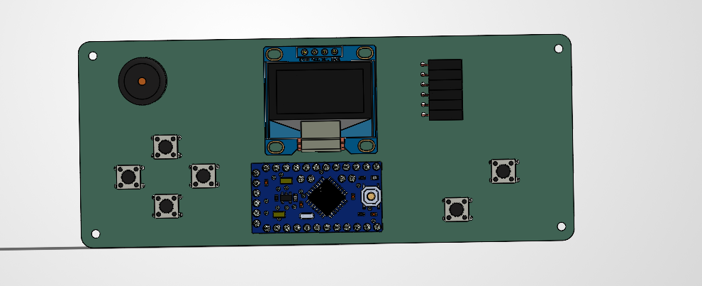
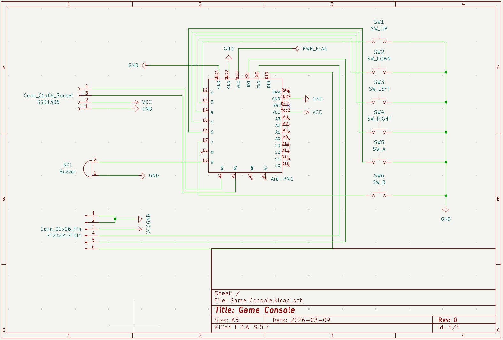
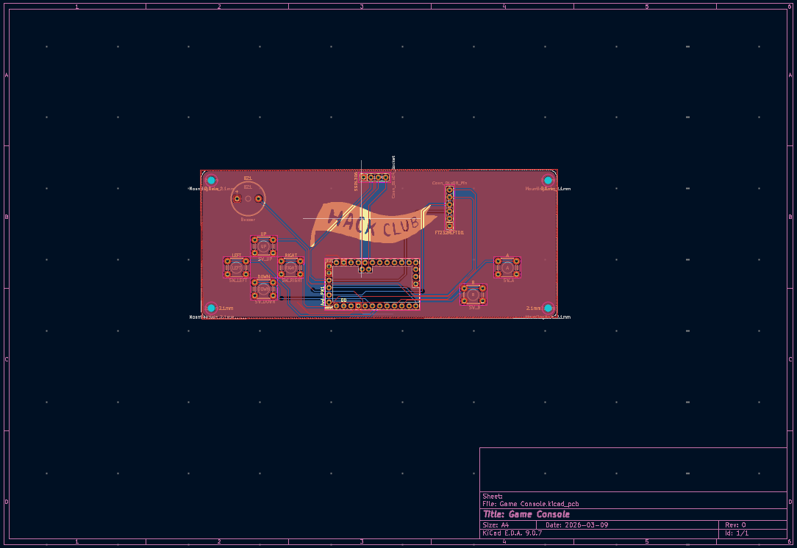

# (NOT SO PORTABLE) Game Console!

### This project's purpose is to use an Arduino Pro Mini + a custom PCB to run a small minigame on a 0.96 OLED screen with real-time buzzer feedback!

### The whole point of the project was to learn more about CADDING and PCB design. Throughout the process, I learned to create custom symbols in KiCad's symbol editor and to run and fix DRC issues. I learned to create assemblies in SolidWorks and to use open-source CAD software for the parts I planned to use.

### Here is version #1 of my project:

### Here is version #2 which was my original final CAD but I improved it and removed the case:

### Here is version #3, the current final:

### Here is the most recent schematic of my project:

### Here is the most recent PCB of my project:

### BOM
| Name | Purpose | Quantity | Total Cost (USD) | Distributor |
|------|---------|----------|-----------------|-------------|
| [FT232RL FTDI Adapter](https://www.amazon.com/gp/product/B0FHP71BCQ/ref=ox_sc_act_title_3?smid=A3CX4TQNUXMB0L&th=1) | Connecting the Arduino Pro Mini to power and computer | 1 | $5.99 | Amazon |
| [Female Header Right Angle 0.1" 6-pin](https://www.amazon.com/Generic-Female-Header-Arduino-LilyPad/dp/B00OE8GTQ8/ref=sr_1_5?dib=eyJ2IjoiMSJ9.OMYfId4JJB0eZdjpZQFtD2b8vHiAVuLjYk6GB872IPM12OdMwTGmzGvdMlPq791cehNRzUCcW2gzgzi7IRLKBUWVLFe4ZRfsX_zvNv-tuIYqKXyvPR2U8-zQifC5jW-p_ha9amBd2QvTY7u1TlyuK-FTA1ClgemV8lKzWq9vBanH8sJ4bhrZNFvJrVMJU5aeJ0iDKp3yy43VkOBRvqNhpsFmLptXRiEaVKlYQFLwoGg.Say9IegxEDnFFbjq5Dj256TruZsi9vu6uQreEcLFhzo&dib_tag=se&keywords=right+angle+female+header&qid=1775770965&sr=8-5) | For connecting the FTDI adapter for the Arduino Pro Mini | 1 | $9.99 | Amazon |
| [PS1240P02BT](https://www.digikey.com/en/products/detail/tdk-corporation/PS1240P02BT/935924) | Buzzer for game feel | 1 | $0.57 | Digikey |
| [PCB](https://jlcpcb.com/) | Houses all the modules | 1 | $6.70 | JLCPCB |
| [Tact Button Switch](https://www.amazon.com/DAOKI-6x6x4-3mm-664-3mm-Momentary-Tactile/dp/B07X8S99RH/ref=sr_1_6_sspa?crid=8UIWIV8EL70F&dib=eyJ2IjoiMSJ9.Df-y1WvZMX-0N8DYLXNdlZlS0lQu8fAVOZWmxxgHVq0PWZV82fgugQqbFvKjgGUO.HoXwnG4VUHuKqeCKPpmxKVAwUe76eCchVRSfuzoZF54&dib_tag=se&keywords=Push%2Bbutton%2B6mmx6mmx4.3mm&qid=1773165291&s=hi&sprefix=push%2Bbutton%2B6mmx6mmx4.3mm%2Ctools%2C128&sr=1-6-spons&sp_csd=d2lkZ2V0TmFtZT1zcF9tdGY&th=1) | Controls of the game | 1 | $4.99 | Amazon |
| [SSD1306](https://www.amazon.com/UCTRONICS-SSD1306-Self-Luminous-Display-Raspberry/dp/B072Q2X2LL/ref=pd_ybh_a_d_sccl_3/138-6471428-0838013?pd_rd_w=WufjE&content-id=amzn1.sym.67f8cf21-ade4-4299-b433-69e404eeecf1&pf_rd_p=67f8cf21-ade4-4299-b433-69e404eeecf1&pf_rd_r=GAB7MCX3YXFJCJSPVCYP&pd_rd_wg=lfuYW&pd_rd_r=41f4390e-6f47-4ed2-99bd-be0129f47c18&pd_rd_i=B072Q2X2LL&psc=1) | OLED Display | 1 | $6.99 | Amazon |
| [Arduino Pro Mini](https://www.amazon.com/Arduino-Pro-Mini-328-16MHz/dp/B004G53J5I/ref=pd_ybh_a_d_sccl_2/138-6471428-0838013?pd_rd_w=1Rg71&content-id=amzn1.sym.67f8cf21-ade4-4299-b433-69e404eeecf1&pf_rd_p=67f8cf21-ade4-4299-b433-69e404eeecf1&pf_rd_r=DMKNHCCF81W10P4MNC8D&pd_rd_wg=YTIhm&pd_rd_r=8940d3c2-13ab-4f26-811c-7a622cb94b2a&pd_rd_i=B004G53J5I&psc=1) | Brains of the console | 1 | $11.25 | Amazon |
